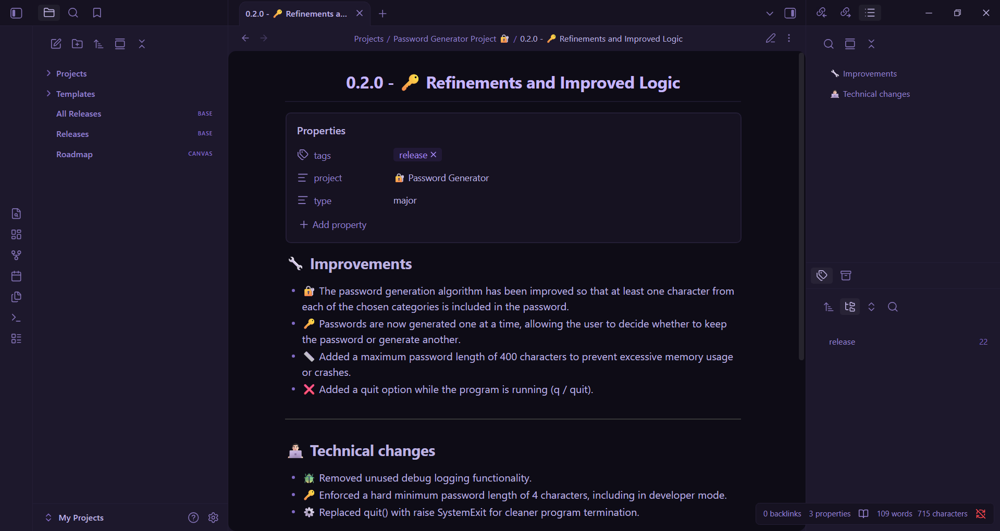
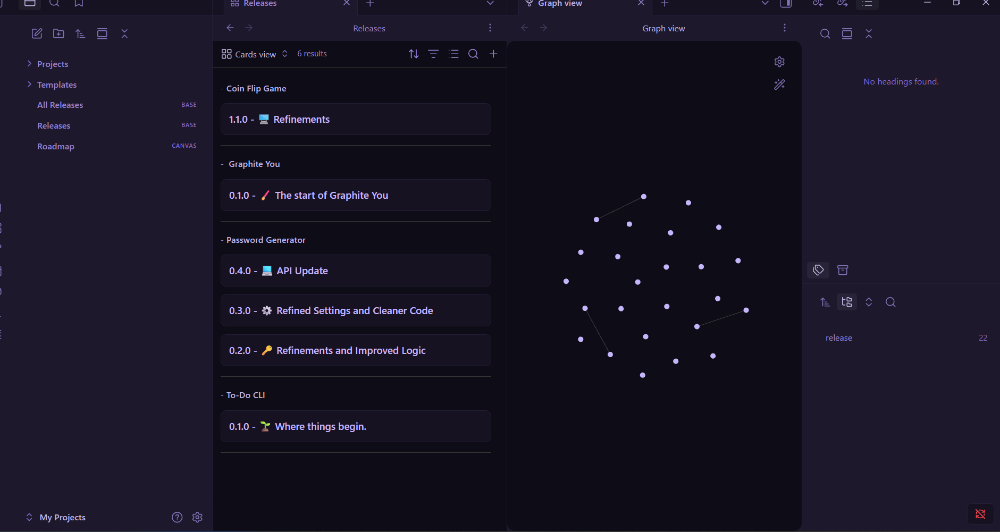
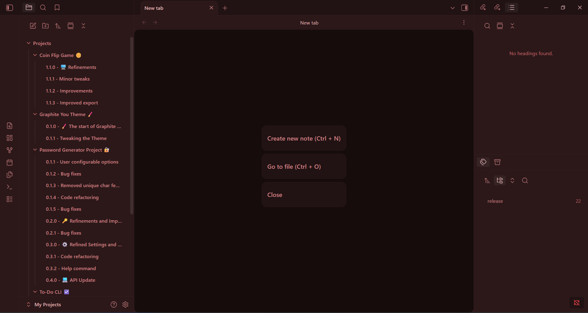

## Neon You
An Obsidian theme with a dynamic colour base and elements based on your accent colour.

[Download and Install](https://lukes-05.github.io/docs/neon-you/pages/Download-Install.html)

### A theme that adapts to you.

Neon You is a theme inspired by Material You's dynamic colour engine. Your Obsidian accent colour is applied to UI elements on top of a dynamically coloured base.

### And I didn't forget about Bases and Canvas.

Your Obsidian bases views get the same treatment - a modern and vibrant UI with plenty of neon colours.

I will be giving Canvas a refresh in a future release.

### And here's another accent colour...

### Features
- 🎨 UI elements complement your accent colour.
- 📘 A spacious UI to reduce cognitive load.
- 👁️ Clearly defined UI elements to make visibility easier.
- 💻 Open source.

**This theme only supports Obsidian dark theme**